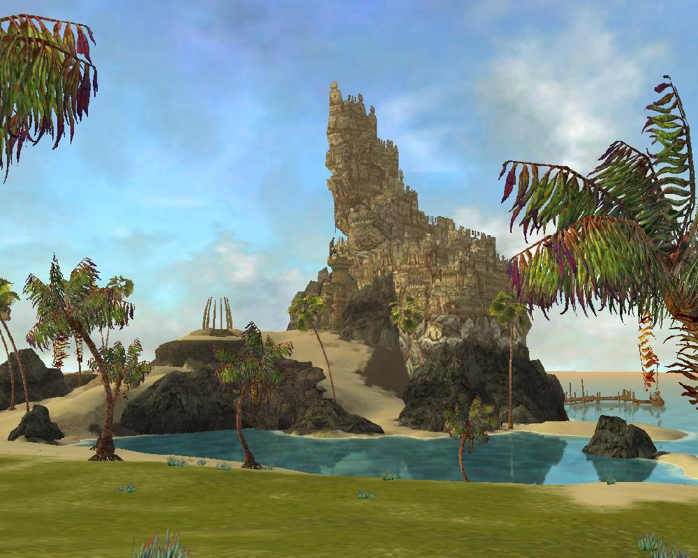
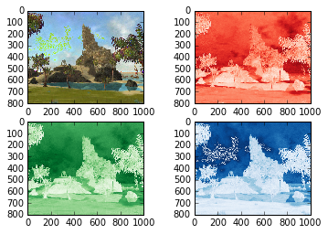

UUECM3033 Assignment #2 Report
========================================================

- Prepared by: ** Loo Li Ping**
- Tutorial Group: T2

--------------------------------------------------------

## Task 1 --  $LU$ Factorization or SOR method

The reports, codes and supporting documents are to be uploaded to Github at: 

[https://github.com/graceloo94/UECM3033_assign2](https://github.com/graceloo94/UECM3033_assign2)

Explain your selection criteria here.
In order to decide which method to solve for matrix A, we will need to check if matrix A is positive definite. We can use the Cholesky Method to factorised matrix A into LL(Transpose) to determine if it is positive definite. SOR method will be used if matrix A is positive definite, else,  LU decomposition will be used. In order to use SOR method, matrix A needs to be positive definite to find an optimal ω that will converge, whereby 0 < ω < 2.

Explain how you implement your `task1.py` here.
To solve by LU decomposition method, there are 2 self-defined function used. LU_decomp(A) which takes in matrix A, and will decomposed it into LU matrix. lu(A,b) is a function which solve and return matrix A and also b by taking in from LU_decomp(A).

To solve by SOR method,  we need to find the maximum absolute eigenvalue to compute the ω. 

$$ω = \frac{2[1-{\sqrt{1-[p(T)]^2)}}]}{[p(T)]^2} $$
whereby pT is the spectral radius. To ensure convergence, the value of ω need to be within 0 < ω < 2.

We start by initialising x(0) as a zero matrix. We will then compute x(j) until the desired iteration. ( I have set the iteration limit to 100). It will return list(sol).

The condition will determined if matrix A will be solved by LU or SOR method. If matrix A is a positive definite matrix, whereby it can be factorised into LL(Transpose) which is the Cholesky Method, we will use SOR method to solve it. Else, the matrix will be solved by LU decomposition method.

Results : Both matrices are solved by LU decomposition method. 
First matrix : [ 1. 1. 1.] 
Second matrix : [ 1. -1. 4. -3.5  7. -1. ]

---------------------------------------------------------

## Task 2 -- SVD method and image compression

Put here your picture file (Watchtower_coast.jpg)

How many non zero element in $\Sigma$?
All the elements in $\Sigma$  are non zero elements.

Put here your lower and better resolution pictures. Explain how you generate
these pictures from `task2.py`.

Original image:

Lower resolution picture: $\Sigma_{30}$

Better resolution picture : $\Sigma_{200}$

A chosen image with resolution of 1000x800 pixels is uploaded and read in the r,g,b format which is a 3 dimensional matrix. Then, we find the U,$\Sigma$ and V of the red, green, blue matrices respectively by using scipy.linalg.svd. Next, we find the non zero elements in $\Sigma$ by using numpy.count_nonzero. A lower resolution matrix is formed by keeping the first 30 non zero elements in $\Sigma$, and setting the other non zero elements to zero. The process can be repeated to find a better resolution matrix for the image as shown in the figures above.

To prevent any loss of information for the matrix, we first create a copy of the original $\Sigma$ for all the red, green, blue matrices such as Sred.copy. After this, we will start to keep the first n non zero elements and setting the others to zero. The new $\Sigma$ generated for each r, g, b matrices is then converted from (800,1) into (800,1000) by using scipy.linalg.diagsvd to perform dot multiplication for U,$\Sigma$,V by using numpy.dot. Thus, a new matrix can be created to generate images of lower or better resolutions.

What is a sparse matrix?
A sparse matrix is a matrix whereby most of the elements are zero. The matrix is considered dense if most of the elements are nonzero. In task 2, when the first 30 elements of $\Sigma$ is kept, and all the other elements are set to zero, a sparse matrix is formed. The dimension of $\Sigma$ is changed from (800,1) to (800,1000). Thus, a large sparse matrix of (800,1000) is formed. When combining U and V using dot multiplication, a lower resolution pictures is created.

-----------------------------------

last modified: 11 March 2016
